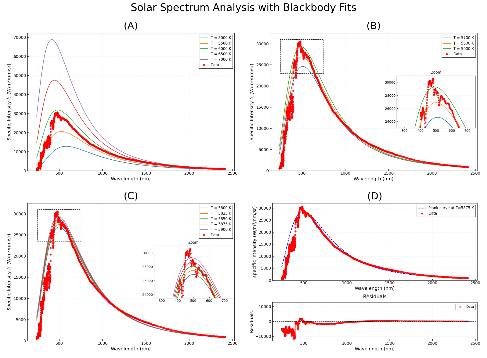

# Solar Spectrum Analysis

This project presents an analysis of the solar spectral irradiance measured by the SORCE/SIM instrument [1], with the goal of estimating the surface temperature of the Sun using two independent methods: a graphical Planck curve fit and numerical integration of the measured spectrum. All the deatil calculations can be found on the analysis.ipynb file.

The observation date selected for analysis is **October 27, 2006**.

---

## Theory

### Monochromatic Flux and Specific Intensity

The SORCE/SIM instrument reports the **monochromatic flux** (spectral irradiance) $F_\lambda$, defined as the power received per unit area per unit wavelength:

$$[F_\lambda] = \left[\frac{\mathrm{W}}{\mathrm{m}^2\,\mathrm{nm}}\right]$$

The **specific intensity** $I_\lambda$ is obtained by dividing by the solid angle subtended by the Sun as seen from Earth:

$$I_\lambda = \frac{F_\lambda}{\Omega_\odot} \quad \left[\frac{\mathrm{W}}{\mathrm{m}^2\,\mathrm{sr}\,\mathrm{nm}}\right]$$

### Solar Solid Angle

The solid angle $\Omega_\odot$ is computed from the apparent angular radius $\alpha$ of the Sun on the observation date (obtained from Stellarium):

$$\Omega_\odot = 2\pi\left(1 - \cos\alpha\right)$$

For October 27, 2006 (apparent diameter 0°32′11.22″, Earth–Sun distance 148,672,000 km):

$$\Omega_\odot = 6.886 \times 10^{-5}\ \mathrm{sr}$$

This agrees closely with the mean value computed from the solar radius and 1 AU ($6.794 \times 10^{-5}\ \mathrm{sr}$), confirming the computation.

### Planck's Law

The theoretical specific intensity of a blackbody at temperature $T$ is given by Planck's law:

$$B_\lambda(\lambda, T) = \frac{2hc^2}{\lambda^5} \frac{1}{e^{hc/\lambda k_B T} - 1}$$

where $h = 6.626 \times 10^{-34}\ \mathrm{J\,s}$, $c = 3 \times 10^8\ \mathrm{m/s}$, and $k_B = 1.381 \times 10^{-23}\ \mathrm{J/K}$.

Fitting $B_\lambda(T)$ to the observed $I_\lambda$ yields the **color temperature** of the Sun.

### Effective Temperature via the Stefan–Boltzmann Law

Integrating the monochromatic flux over all measured wavelengths and correcting for the Earth–Sun distance gives the total flux emitted at the solar surface. The **effective temperature** $T_\mathrm{eff}$ is then obtained from the Stefan–Boltzmann law:

$$F_\odot = \sigma T_\mathrm{eff}^4 \implies T_\mathrm{eff} = \left(\frac{F_\odot}{\sigma}\right)^{1/4}$$

---

## Analysis

### 1. Monochromatic Flux Spectrum

The solar spectral irradiance $F_\lambda$ is plotted as a function of wavelength. The spectrum closely resembles a Planck blackbody curve, and the reported measurement uncertainties are negligible.

### 2. Solar Solid Angle

The solid angle of the Sun for the observation date is derived from the apparent angular diameter reported by Stellarium and cross-checked against the mean value computed from the solar radius and 1 AU. Both values agree to within 1.4%.

### 3. Specific Intensity Spectrum

The monochromatic flux is converted to specific intensity by dividing by $\Omega_\odot$. The resulting spectrum retains the characteristic shape of a Planck distribution.

### 4. Color Temperature — Graphical Planck Fit

Planck curves at various temperatures are overlaid on the observed specific intensity spectrum. The fitting criteria require that the theoretical curve:
- has its maximum as close as possible to the observed spectral peak, and
- intersects at least one data point both before and after the maximum.

The figure below shows the progressive refinement of the fit (panels A through D):

Careful inspection shows that curves above 5900 K approach the observed peak but fail to cross any data point prior to the maximum. The temperature that best satisfies both criteria simultaneously is:

$$\boxed{T_\mathrm{color} = 5875\ \mathrm{K}}$$

### 5. Effective Temperature — Spectral Integration

The total solar irradiance is computed by integrating $F_\lambda$ over the full measured wavelength range using the trapezoidal rule, then correcting for the Earth–Sun distance on the observation date ($r = 0.994\ \mathrm{AU}$, using $F \propto r^{-2}$):

$$F_\mathrm{computed} = 1337.9\ \mathrm{W/m^2}$$

This is in close agreement with the value officially reported by the SORCE/TIM instrument for the same date:

$$F_\mathrm{SORCE/TIM} = 1360.8\ \mathrm{W/m^2}$$

The small discrepancy arises because the TIM instrument covers additional wavelength ranges not included in the SIM data. Scaling the integrated flux to the solar surface using the solar radius and Earth–Sun distance, the effective temperature is:

$$\boxed{T_\mathrm{eff} = 5747.1\ \mathrm{K}}$$

---

## Results Summary

| Method | Temperature |
|---|---|
| Graphical Planck fit (color temperature) | 5875 K |
| Spectral integration (effective temperature) | 5747.1 K |
| Accepted value [2] | 5778 K |

Both estimates are in close agreement with the accepted value. The effective temperature derived from spectral integration is slightly more accurate, likely because trapezoidal integration is more robust to spectral noise than an empirical visual fit to the Planck curve.

---

## Data Sources

- **SORCE/SIM**: Solar Spectral Irradiance, Level 3, 24-hour means, 240–2413 nm [1]
- **SORCE/TIM**: Total Solar Irradiance, Level 3, 24-hour means [1]
- **Stellarium**: Apparent solar angular diameter and Earth–Sun distance for October 27, 2006

---

## References

[1] J. Harder (2020), *SORCE SIM Level 3 Solar Spectral Irradiance Daily Means V027*, Greenbelt, MD, USA, Goddard Earth Sciences Data and Information Services Center (GES DISC). DOI: [10.5067/LDDKZ3PXZZ5G](https://doi.org/10.5067/LDDKZ3PXZZ5G). Accessed: Apr. 18, 2026.

[2] M. Stix, *The Sun: An Introduction*, 2nd ed. Springer, 2002, p. 10. Available: https://link.springer.com/book/10.1007/978-3-642-56042-2. Accessed: Apr. 19, 2026.

[3] P. J. Mohr, D. B. Newell, y B. N. Taylor, “CODATA recommended values of the fundamental physical constants: 2014,” Rev. Mod. Phys., vol. 88, n.º 3, p. 035009, sep. 2016. doi: 10.1103/RevModPhys.88.035009.